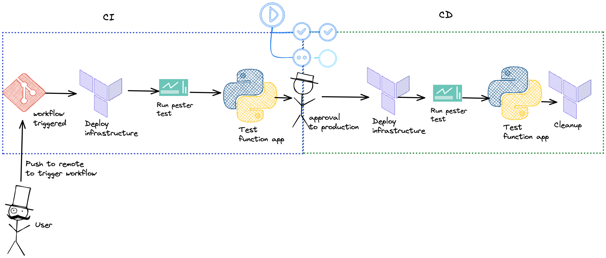
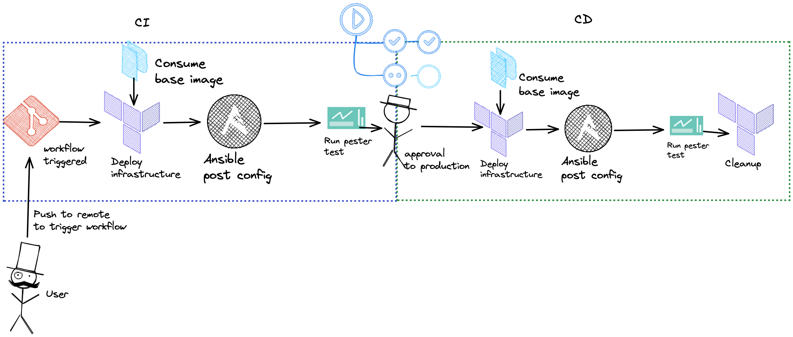
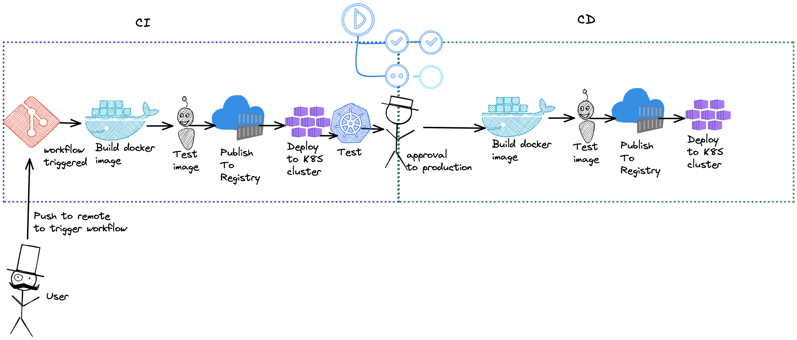
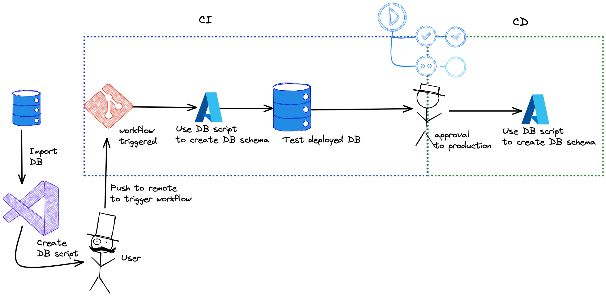

###### <!--fit--> Jupiter assessment

---

# <!--fit--> Part 1: Detailing a Dev Ops Pipeline

---

#### CI/CD strategy for an Azure Function

---
##### The infrastructure required

* A resource group which provides a logical container for all other resources.
* A storage account which is used to managed triggers and logging.
* An application service plan, which hosts the function.
* Application insights for monitoring.
* The function app which will host the triggered function.
* The function app function with trigger.

---

##### Deploying the infrastructure using pipelines
##### What will the CI part of the pipeline look like?
* Re-run CI tasks within a production pipeline environment.
* The deployment portion of the pipeline will include required reviewers.
* Required reviewers will prevent any unaccounted changes from happening in a production environment.
* Once reviewed and approved the infrastructure built within the dev and test environments can be destroyed to prevent technical debt.
* An additional step could be to update documentation on a platform such as confluence through the terraform API. 
* I have created a repository for a function app deployment. This code has not been tested on an azure subscription and is based on my past experience. click [here](https://github.com/azdim/jupiter_azure_function_app).

---
##### Deploying the infrastructure using pipelines
##### What will the CD part of the pipeline look like?
* Re-run CI tasks within a production pipeline environment.
* The deployment portion of the pipeline will include required reviewers.
* Required reviewers will prevent any unaccounted changes from happening in a production environment.
* Once reviewed and approved the infrastructure built within the dev and test environments can be destroyed to prevent technical debt.
* An additional step could be to update documentation on a platform such as confluence through the terraform API. 

---
##### Pipeline summary

---
#### CI/CD strategy for a Python project running on a VM

---
#### The infrastructure required
* Base machine image configured with required packages. An image can be created using Packer where an available base image such as ubunutu-latest is configured through a tool such as Ansible.
* Resource group which provides a logical container for all other resources. The packer image build should have it's own pipeline.
* Linux virtual machine. Linux because Ansible can be used for post configuration management.
* Network interface card to allow the virtual machine to be connected to a Virtual network.
* Key-vault to save credentials of the Virtual machine.
* Log analytics workspace. Used with Azure monitor for metrics.
* Storage account. To store analytics.

---
#### What will the CI look like?
* Deploy terraform defined infrastructure using terraform.
* Run unit tests to sanity check the code within the repository.
* Run pester test to check if the deployed infrastructure has the right naming convention, tags and IAM policies assigned.
* Upload python from repository to VM using azblob copy.
* Ansible post configuration to activate virtual environment and install dependencies.
* Node-exporter installed to expose metrics for monitoring using applications such as Prometheus and Grafana.
* Run tests to check for application status. If the python project dumps periodic logs, these can be exposed for monitoring.

---
#### What will the CD look like?
* Re-run CI jobs within a production environment with required reviewers.
* Required reviewers allows for tech leads to review changes prior to deploying to production environment.
* Check Python project status.

---
##### Pipeline summary

---
#### CI/CD strategy for a Python project running on a container

---
#### The infrastructure required
Since the project is containarised the required infrastructure is minimal. The following are pre-requisites to deploying a containarised python project. However, the pre-requsite infrastructure could easily be pipelined.
1. Azure Container Registry: Store docker images
2. Azure Kubernetise Service: Kubernetes cluster to run the docker image on. 

* The Kubernetes cluster can be hosted on VMs and managed by an in house team. It does not need to be AKS. In fact it does not need to be Kubernetes, another product from Hashicorp is Nomad which is an alternative to Kubernetise.

---
#### What will the CI look like?

* Build a tagged Docker package and test for security breaches.
* Deploy Docker image in a development Kubernetes cluster.
* Test status of Kubernetes deployment through monitoring applications such as Prometheus and Grafana.
* An additional step would be to load test the application, especially if a database is involved.

---
#### What will the CD look like?

* Re-run CI jobs in a production environment.
* Implement required reviewers prior to promoting to production.
* Cleanup development docker images to save on costs.

---
##### Pipeline summary

---
#### Implementation of a CI/CD pipeline for SQL database changes

---
#### Pre-requisites

* Import the schema of an existing database using Visual Studio.
* Create a database publish profile.

---
#### What will the CI look like?
* Use the [visual studio build task](https://docs.microsoft.com/en-us/azure/devops/pipelines/tasks/build/visual-studio-build?view=azure-devops) to create the DACPAC file. Which will be a build artifact.
* Copy SQL database profile to the appropriate build directories.

---
#### What will the CD look like?
* Download CI build artifacts.
* Use [Azure database deployment task](https://docs.microsoft.com/en-us/azure/devops/pipelines/tasks/deploy/sql-azure-dacpac-deployment?view=azure-devops) to deploy the Database.

---
### GitHub actions pipelines

* The Python package release and Docker image publish has been implemented within a single repository.
* This pipeline publishes the Docker image to GitHub container registry.
* The Python package is deployed to PyPI.
* All references are mentioned within the repository.

* Link to repository: [here](https://github.com/azdim/jupiter_docker_workflow)
* Release on merge to main workflow: [here](https://github.com/azdim/jupiter_docker_workflow/blob/main/.github/workflows/main.yaml)

---

##### Pipeline summary

---
# <!--fit-->  Part 2: DevOps Quick Fire Questions

---
#### Pipeline for a webapp written in python Flask or Django

* First the webapp will need to be run within a virtual environment such that the package dependencies are fixed. The webapp is then tested locally with tools such as selenium to make sure the properties of the flask app itself work as intended. Within a a pipeline the Python environment is activated and dependencies installed. Build artifacts are published and deployed to azure webapp, where further testing can be implemented.
* Personally the challenges I will face will be around the deployment of the bash script onto Azure webapp as I have not used this service before. The flask apps that I had created were based on containers.

---
#### Pipeline for a SQL database project?

* Import existing databases and generate a schema script locally using Visual Studio. This script will then be used by the CI pipeline to generate DAPAC files, which are then published as artifacts. Once the artifacts are published they can be ingested by the CD stage to deploy a SQL database with changes.
* The challenges will be knowing how to add changes to a database and deploy it with zero downtime.

---
#### What KPIs would you track for a build and deploy pipeline and how would you report on them?
* Time for a pipeline to complete, test pass percentage, number of runs within a given period of time, production approvals to disapproval ratio and value added. Most of the measurements can be visualised within an Azure DevOps dashboard. These dashboards are updated live and can be monitored through a QA team with Kusto queries added for notifications.
* The main challenge would be to decide how valuable a new deployment feature is. The reason being that it is not a statistical metric, this metric is defined through opinions.

---
#### What elements should you consider when considering on-prem vs. cloud vs. hybrid?
* Scale of current and future operations, difficulty of migrating from on-prem to cloud or hybrid, the value added of moving to a cloud, security and credential management especially in a hybrid cloud environment, SLAs and SLOs matching what a company needs to what a cloud provider can offer. And last but certainly not least the regulatory aspect of the workloads performed within the cloud.
* Challenges include calculating the cost for future workloads in order to determine value of migrating to cloud. Knowing the scale can greatly reduce cost, since Azure as well as other cloud providers offer reserved instances.

---
#### How would you design a build pipeline for a project in Azure Databricks?
* Make changes to a Notebook within an Azure Databricks dev workspace, which exists within a feature branch, where the code can be locally tested. Once the branch is merged to main a worklow is triggered. Where the dev notebook is used to create a new workbook within a staging workspace. Once the workbook has been published a build artifact, a range of tests can take place to verify the properties of the workbook. Once these tests pass, the staging notebook is converted into a production notebook within a production workspace.
* Difficulties will be understanding how to switch between workspaces and how the tests can be visualised.

---

###### <!--fit--> Thank you

